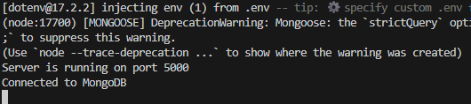

To run the application you need to:

* Install dependencies with `npm i`
* Create a `.env` file with the variable `DB_AUTH` for connecting to the MongoDB database
* Run application with comand `node index.js`